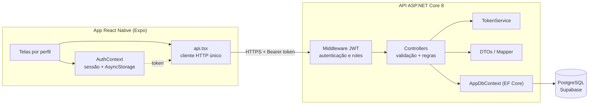
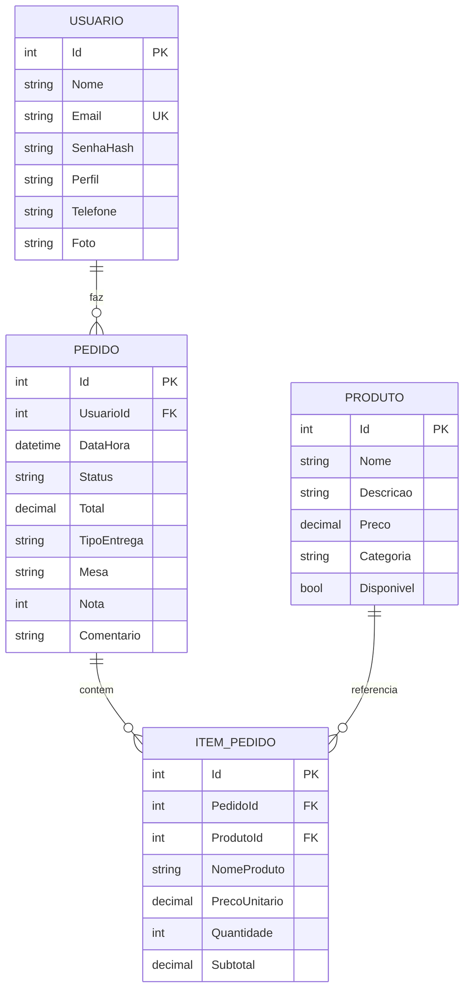

# Sistema de Pedidos para Lanchonete

Aplicação mobile multi-perfil para operação de uma lanchonete, com API REST própria e banco relacional. Cobre o ciclo completo do pedido: o cliente monta o carrinho, a cozinha acompanha a fila e avança o status, e a administração gerencia o cardápio e analisa as vendas.

O aplicativo não acessa o banco de dados diretamente. Toda leitura e escrita passa pela API, que concentra autenticação, autorização e regras de negócio — o cliente móvel é tratado como não confiável por princípio.

Projeto acadêmico, com escopo e modelagem definidos para exercitar um fluxo operacional realista de ponta a ponta.

## Stack

| Camada | Tecnologias |
| --- | --- |
| Mobile | React Native 0.85, React 19, Expo 56, React Navigation 7 (native stack + bottom tabs), Context API, AsyncStorage, expo-image-picker |
| API | C# / .NET 8, ASP.NET Core Web API, Entity Framework Core 8, Swashbuckle (OpenAPI/Swagger) |
| Segurança | JWT assinado com HMAC-SHA256, BCrypt para hash de senha, autorização declarativa por roles |
| Dados | PostgreSQL (Supabase), provider Npgsql |

Aproximadamente 1.000 linhas de C# e 2.200 de código do app, distribuídas em 19 endpoints e 13 telas.

## Arquitetura



A separação em três camadas é estrita: o app não conhece o esquema do banco, apenas o contrato da API; a API não devolve entidades de domínio, apenas DTOs; e o acesso a dados fica isolado no `AppDbContext`.

### Autenticação e autorização

O login valida a senha com BCrypt e devolve um JWT contendo `id`, `nome`, `email` e `role`. O app persiste a sessão em `AsyncStorage` e injeta o token em toda requisição. A API valida assinatura e expiração a cada chamada e resolve as permissões a partir das claims:

```csharp
options.MapInboundClaims = false;
options.TokenValidationParameters = new TokenValidationParameters
{
    ValidateLifetime = true,
    ValidateIssuerSigningKey = true,
    IssuerSigningKey = new SymmetricSecurityKey(Encoding.UTF8.GetBytes(chaveJwt)),
    NameClaimType = "nome",
    RoleClaimType = "role"
};
```

Desativar `MapInboundClaims` evita a reescrita automática das claims para as URIs longas do padrão SOAP, mantendo os nomes curtos emitidos pelo `TokenService`. Com `RoleClaimType` apontando para `role`, a autorização fica declarativa nos controllers:

```csharp
[HttpGet("cozinha")]
[Authorize(Roles = $"{Perfis.Cozinha},{Perfis.Admin}")]
public async Task<ActionResult<IEnumerable<PedidoRespostaDto>>> FilaCozinha()
```

O roteamento do app espelha essa mesma divisão: `App.tsx` escolhe o navigator conforme o perfil da sessão, de modo que cada usuário só recebe as telas do seu papel. A restrição visual é conveniência de interface — a garantia real está no servidor.

## Decisões de projeto

**Preço histórico congelado no item do pedido.** `ItemPedido` grava `NomeProduto`, `PrecoUnitario` e `Subtotal` no momento da compra, em vez de depender de um join com `Produto` na hora da leitura. Alterar o preço do cardápio não reescreve o valor de pedidos passados, e o relatório de vendas permanece fiel ao que foi efetivamente cobrado.

**O total é calculado no servidor.** O app envia apenas `produtoId` e `quantidade`. A API busca o preço no banco, valida a disponibilidade de cada item e deriva subtotais e total. Nenhum valor monetário vindo do cliente é aceito.

**Máquina de estados explícita.** O pedido percorre `Recebido → EmPreparo → Pronto → Entregue`, com `Cancelado` como saída. As transições sensíveis são validadas por regra de negócio, não por interface: cancelar só é permitido enquanto o pedido está em `Recebido`, e avaliar só depois de `Entregue`.

```csharp
if (pedido.Status != StatusPedido.Recebido)
    return BadRequest("So da para cancelar enquanto o pedido ainda nao foi preparado.");
```

**Escopo por proprietário.** Endpoints de cliente filtram pelo id extraído do token, nunca por um id recebido na requisição, o que impede que um usuário autenticado acesse ou cancele o pedido de outro:

```csharp
var pedido = await _db.Pedidos
    .FirstOrDefaultAsync(p => p.Id == id && p.UsuarioId == UsuarioLogadoId);
```

**Integridade referencial no modelo.** `Pedido → ItemPedido` usa cascata, já que o item não existe fora do pedido. `ItemPedido → Produto` usa `Restrict`, protegendo o histórico. A regra é reforçada na aplicação: excluir um produto já vendido é bloqueado e a orientação é marcá-lo como indisponível.

**Precisão monetária.** Todos os campos de dinheiro são `decimal` mapeados com `HasPrecision(10, 2)`, evitando os erros de arredondamento de ponto flutuante.

**DTOs separados das entidades.** Requisições e respostas trafegam por `record` types dedicados, com um mapper isolando a conversão. `Usuario` carrega `SenhaHash`, que nunca alcança a serialização por não existir em nenhum DTO de saída.

**Cliente HTTP único no app.** Toda comunicação passa por uma função `requisitar` que centraliza cabeçalhos, injeção do token, parsing e tradução de erro. Os status HTTP viram mensagens de domínio em um só lugar, e as telas tratam apenas `Error`:

```js
if (resposta.status === 401) msg = "Sessao expirada. Entre novamente.";
else if (resposta.status === 403) msg = "Voce nao tem permissao para isso.";
```

**Polling atrelado ao ciclo de vida da tela.** A fila da cozinha se atualiza a cada 8 segundos, mas o intervalo é criado por `useFocusEffect` e destruído no cleanup ao sair da tela — sem requisições em segundo plano nem timers órfãos:

```js
useFocusEffect(
  useCallback(() => {
    carregar();
    const intervalo = setInterval(carregar, 8000);
    return () => clearInterval(intervalo);
  }, [carregar])
);
```

**Configuração externalizada.** O endereço da API vem de `EXPO_PUBLIC_API_URL`, permitindo alternar entre emulador, dispositivo físico na rede local e túnel sem tocar no código.

## Modelo de dados



O e-mail tem índice único no banco, além da checagem na camada de aplicação. Perfis e status são constantes tipadas (`Perfis`, `StatusPedido`), eliminando strings mágicas espalhadas pelos controllers.

## API

| Método | Rota | Acesso |
| --- | --- | --- |
| POST | `/api/auth/registro` | Anônimo |
| POST | `/api/auth/login` | Anônimo |
| GET | `/api/produtos` | Autenticado |
| GET | `/api/produtos/admin` | Admin |
| POST | `/api/produtos` | Admin |
| PUT | `/api/produtos/{id}` | Admin |
| DELETE | `/api/produtos/{id}` | Admin |
| POST | `/api/pedidos` | Cliente |
| GET | `/api/pedidos/meus` | Cliente |
| PUT | `/api/pedidos/{id}/cancelar` | Cliente |
| PUT | `/api/pedidos/{id}/avaliacao` | Cliente |
| GET | `/api/pedidos/cozinha` | Cozinha, Admin |
| GET | `/api/pedidos/historico` | Cozinha, Admin |
| PUT | `/api/pedidos/{id}/status` | Cozinha, Admin |
| GET | `/api/pedidos/vendas?periodo=` | Admin |
| GET | `/api/perfil` | Autenticado |
| PUT | `/api/perfil` | Autenticado |
| PUT | `/api/perfil/senha` | Autenticado |
| GET | `/api/clientes` | Admin |
| GET | `/api/clientes/{id}` | Admin |

O relatório de vendas agrega no servidor por período (`hoje`, `semana`, `tudo`), devolvendo faturamento, contagem por status e ranking dos cinco itens mais vendidos, com pedidos cancelados excluídos do faturamento.

A documentação interativa é gerada via OpenAPI e exposta em `/swagger` no ambiente de desenvolvimento, com o esquema de segurança Bearer configurado para autenticar as chamadas direto pela interface.

## Funcionalidades por perfil

**Cliente** — cardápio com busca textual e filtro por categoria, carrinho com controle de quantidade, escolha do tipo de entrega (mesa ou viagem), observações no pedido, acompanhamento em tempo quase real, cancelamento dentro da janela permitida, avaliação com nota e comentário, repetição de pedidos anteriores e edição de perfil.

**Cozinha** — fila de pedidos ativos com atualização automática e pull-to-refresh, avanço de status em uma ação, cancelamento com confirmação e histórico de pedidos finalizados.

**Administração** — CRUD de produtos com ativação e desativação direta na listagem, relatório de vendas por período com faturamento e ranking de itens, base de clientes com contagem de pedidos e histórico individual detalhado.

## Estrutura do repositório

```
backend/                    API ASP.NET Core 8
  Controllers/              Auth, Produtos, Pedidos, Perfil, Clientes
  Models/                   Entidades e constantes de domínio
  Dtos/                     Contratos de entrada e saída + mapper
  Services/                 TokenService (emissão de JWT)
  Data/                     AppDbContext e bootstrap do esquema
  Program.cs                Composição: DI, JWT, CORS, Swagger, pipeline

frontend/                   App React Native (Expo)
  App.tsx                   Raiz: resolve o navigator pelo perfil
  src/api.tsx               Cliente HTTP e superfície da API
  src/AuthContext.tsx       Sessão e persistência local
  src/config.tsx            Configuração por variável de ambiente
  src/navigation/           Um navigator por perfil + fluxo de autenticação
  src/screens/              Telas agrupadas por perfil
  src/components/           Componentes reutilizados
  src/theme.tsx             Paleta centralizada
  src/utils.tsx             Formatação de moeda, data e entrega
```

## Executando localmente

**API** (requer .NET 8)

```bash
cd backend
# crie appsettings.Development.json com a connection string do PostgreSQL
# o appsettings.json versionado mostra o formato esperado
dotnet run
```

Na primeira execução o esquema é criado e populado com dados de demonstração — usuários dos três perfis, cardápio e pedidos históricos para o relatório ter conteúdo. Swagger disponível em `http://localhost:5159/swagger`.

**App** (requer Node e Expo CLI)

```bash
cd frontend
npm install
cp .env.example .env      # ajuste EXPO_PUBLIC_API_URL se necessário
npx expo start
```

O padrão `http://10.0.2.2:5159` aponta para o host a partir do emulador Android. Em dispositivo físico, use o IP da máquina na rede local ou um túnel.

**Usuários de demonstração** (senha `123456` para todos)

| E-mail | Perfil |
| --- | --- |
| `admin@lanche.com` | Admin |
| `cozinha@lanche.com` | Cozinha |
| `cliente@lanche.com` | Cliente |

## Limitações conhecidas e próximos passos

Decisões tomadas para manter o escopo do trabalho, com o encaminhamento que teriam em produção:

- **Esquema do banco** — hoje criado no boot com SQL idempotente (`ADD COLUMN IF NOT EXISTS`); o caminho correto é EF Core Migrations com histórico versionado.
- **Segredo do JWT** — vive em `appsettings.json` para facilitar a avaliação; deve migrar para variável de ambiente ou secret manager, com rotação.
- **CORS** — liberado para qualquer origem em desenvolvimento; restringir por origem antes de expor a API.
- **Tipagem** — o app usa a extensão `.tsx` com `strict` desligado e sem anotações; concluir a tipagem das telas e do cliente HTTP é o próximo passo natural.
- **Testes** — não há suíte automatizada; as regras de negócio dos controllers (transições de status, cálculo de total, escopo por proprietário) são as candidatas naturais a testes de integração com xUnit.
- **Imagens** — a foto de perfil é armazenada como data URI em coluna de texto, o que é simples mas não escala; o destino é object storage com URL persistida.
- **Atualização da cozinha** — o polling de 8 segundos resolve o caso de uso, mas SignalR ou push eliminaria a latência e o tráfego ocioso.
- **Paginação** — as listagens retornam o conjunto completo, adequado ao volume atual e insuficiente para uma base real.
